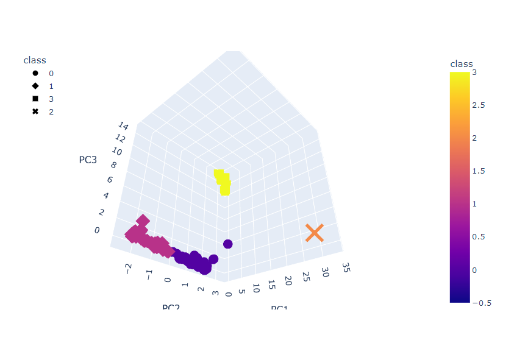
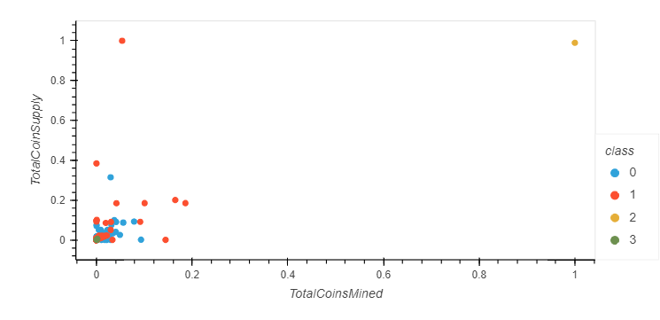

# Cryptocurrencies
 Unsupervised Machine Learning

### Module 18 Cryptocurrency Unsupervised Machine Learning Challenge
**File:** [crypto_clustering](crypto_clustering.ipynb) 

## Overview
The purpose of this challenge is to first clean the data to be prepped for unsupervised machine learning. Use the PCA algorithm to reduce the dimensions of the dataframe to 3 features. Then use the Kmeans algorithm and plot an elbow chart to find the best k value for the data. Then we create visualizations to display our results.

- 3D Scatter Plot with the 3 Principal features 

- 2D Scatter Plot: TotalCoinsMined vs TotalCoinsSupply (Scaled values)

